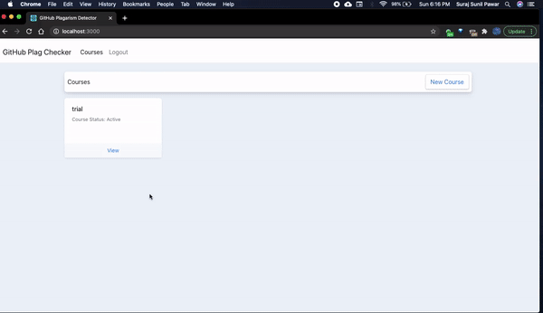
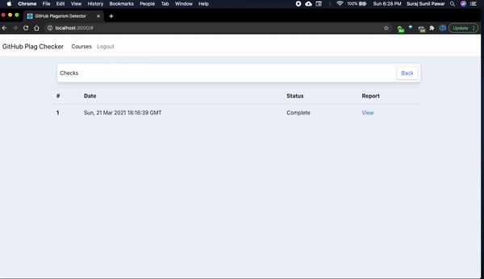

## GitHub Plagarism Detector
  

This is an automation tool for detecting plagarism in the code assignments. 

Note: This project uses MOSS software by Standford Univerity
### Demo 

### Tech Stack 
- Flask
- React 
- Postgresql

### Execution
- cd to root dir ie. GPD
- `npm run start`

- cd to GPD/server
- `flask run`

- Start postgresql server using `pg_ctl -D /usr/local/var/postgres start`

### Installation 

<b> > Back End </b>

`pip install Flask`

`cd server`

`pip install -r requirements.txt`

<b> > Front End </b>

Install Npm, React 

<b> > Postgres</b> 

For Mac, postgresql DB installation

Get homebrew

`brew update then brew  doctor `

`brew install postgresql`

start server using `pg_ctl -D /usr/local/var/postgres start`

Enter  `psql postgres` to get started

Some handy command for Postgres

- `CREATE DATABASE gpd_dev;`
- Dump .pgsql into DB `psql gpd_dev < /Users/spawar2/Desktop/GitHub-Plagiarism-Detector/server/db.pgsql`

Useful commands in psql command line 
- to use DB `\c gpd_dev `
- To list all DBS `\list`
- To list all Tables use  `\dt`
- To Empty table  `truncate [table_name] cascade; #if foreign keys are there`
